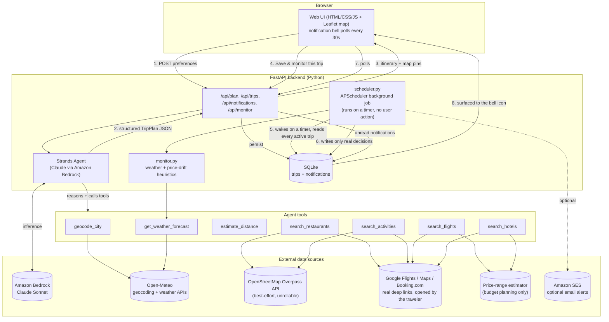
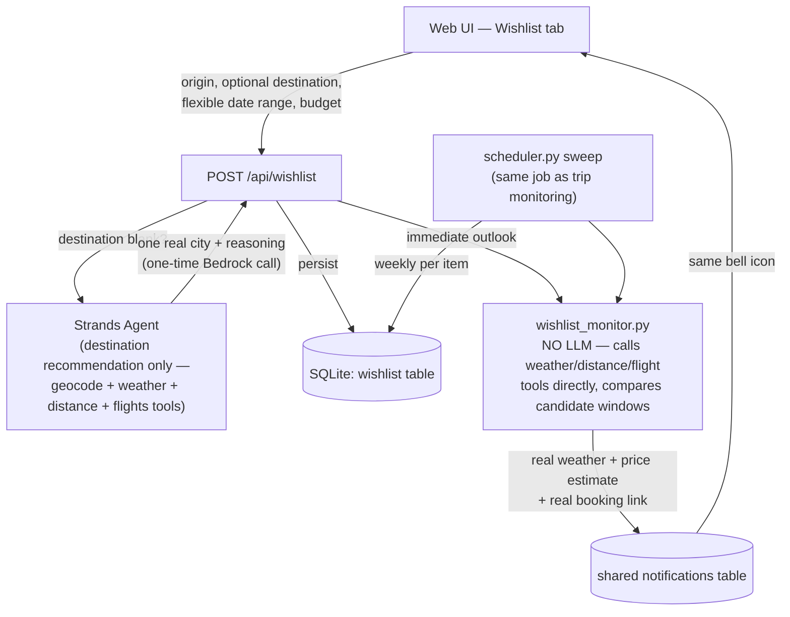
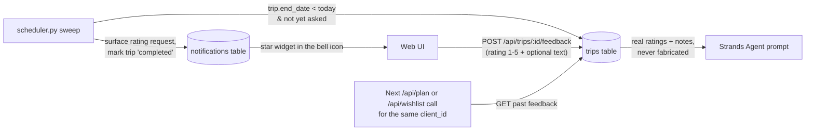
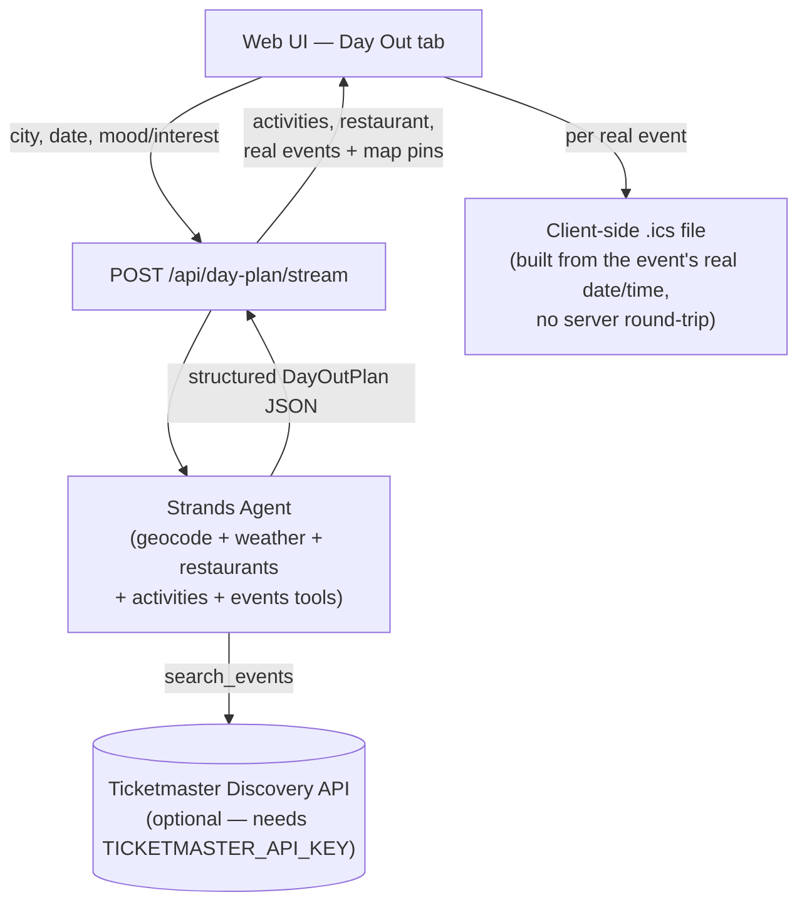
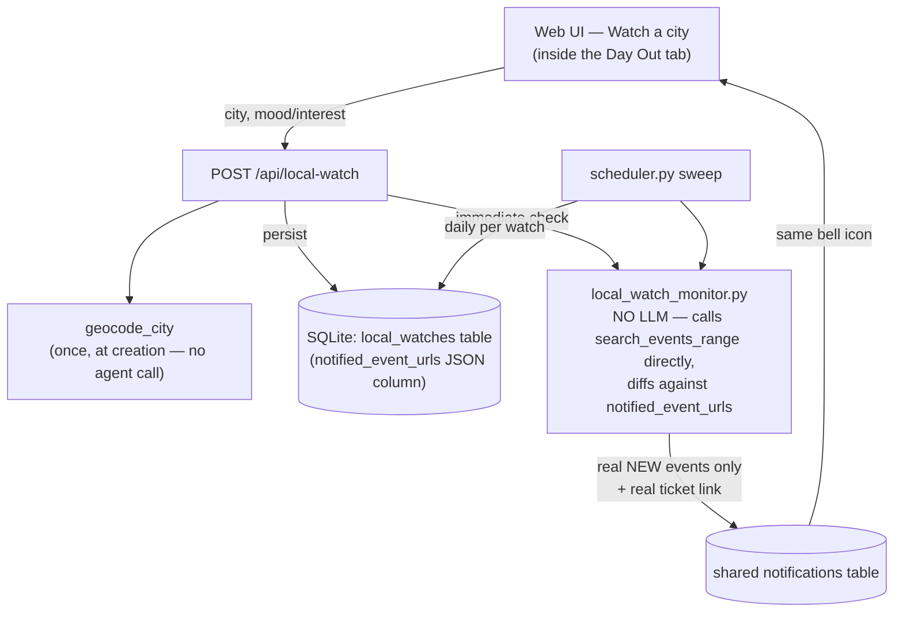

# Architecture

## Flow

1. **Phase 1 — Interactive planning.** The traveler fills in origin, destination (optional), dates, budget, interests, transportation, accommodation, and dietary needs in the web UI. Editing any field after a plan exists triggers a debounced re-plan, so the itinerary and map stay live-updated without a manual resubmit.
2. **Agent reasoning.** The FastAPI backend hands the request to a Strands `Agent` running on Claude (via Amazon Bedrock). The agent decides which tools to call and in what order — geocoding, weather, distance, flights, hotels, restaurants, activities — and reasons over the results to build one concrete itinerary that fits the stated budget and preferences. If no destination was given, the agent picks one itself and says so.
3. **Structured output.** The agent's final answer is constrained to a Pydantic schema (`TripPlan`), so the backend gets clean JSON — flight/hotel estimate + real booking link, day-by-day plan, and map pins — with no text-parsing required.
4. **Locking in a trip.** `POST /api/trips` persists the finished plan to SQLite. This is the moment a disposable plan becomes something the system is responsible for watching.
5. **Autonomous background sweep — the actual "agent," not a button.** `scheduler.py` runs an APScheduler job on a timer (default every 4 hours, configurable) entirely inside the backend process. On each wake-up it reads every active trip from SQLite and calls the same `monitor.check_for_updates()` logic used for on-demand checks — re-checking the live weather forecast and re-estimating flight/hotel pricing. No browser tab needs to be open and no user needs to click anything for this to run.
6. **Surfacing only real decisions.** An update is written to the `notifications` table only when it crosses a real threshold (a meaningful estimated price move, or a day with a high rain chance) — never on every fluctuation, and it never rewrites the plan itself. Every surfaced update carries the same real Google Flights/Hotels booking link, so the traveler can act immediately.
7. **Delivery.** The frontend polls `GET /api/notifications` every 30 seconds and shows a badge/inbox on the bell icon. If the trip was saved with an email address, the same update is also sent via Amazon SES — so a real decision can reach the traveler even if they never reopen the app.

## Data sources

| Tool | Source | Notes |
|---|---|---|
| `geocode_city` | Open-Meteo Geocoding API | Free, no key |
| `get_weather_forecast` | Open-Meteo Forecast API | Free, no key; outside the ~16-day forecast horizon, falls back to real historical weather — same calendar dates averaged across the last 3 years, not a generic guess |
| `estimate_distance` | Computed (haversine) | No external dependency, always available |
| `search_restaurants` / `search_activities` | OpenStreetMap Overpass API (best effort) + Google Maps search link (always) | Overpass is unreliable in practice (the public instance returned HTTP 406 during development) so it's treated as bonus enrichment only. Every recommendation — named or themed — always carries a real, official Google Maps deep link (`google.com/maps/search/?api=1&query=...`), so the traveler can always see genuine current options |
| `search_flights` | Travelpayouts Data API (optional, free token) for a real cached price, falling back to a price-range estimate, + Google Flights link (for today's real price either way) | Travelpayouts returns real prices cached from actual traveler searches — not live-quoted, and not tied to a specific carrier claim. `search_flights` resolves each city to an IATA code by nearest-coordinate match against a bundled Travelpayouts city dataset (`data/travelpayouts_cities.json`, filtered to flightable cities, matched within 75km); if a real cached fare is found, it's returned as-is (`real_price_observed: true`, multiplied by traveler count) — the agent reports plainly whether it's for the exact dates or the closest cached ones. If no token is configured, the coordinates don't resolve to a nearby airport, or Travelpayouts has nothing cached for the route, it falls back to the same honest distance/season estimate range as before (`real_price_observed: false`). Either way a real, pre-filled Google Flights deep link is included |
| `search_hotels` | Price-range estimate (for budget math) + Booking.com search link (for real prices) | No free self-service API returns real live hotel prices as of Aug 2026, and every option (Booking.com/Expedia *partner/affiliate* APIs) requires an approved business/commercial account. Rather than fabricate a specific hotel name — or scrape hotel results, which violates ToS and is fragile to layout/CAPTCHA changes — `search_hotels` returns an honest estimate range (based on destination, accommodation tier, and the same real seasonal-demand pattern used for flights) plus a real, pre-filled deep link showing real current options to book. Google Hotels was tried first — its `checkin`/`checkout` URL params were verified by hand to be silently ignored, always opening to an unrelated default date — so this links to Booking.com's public search page instead (not their partner API, just the same URL a visitor would use directly), which was verified to correctly apply both dates and the traveler count |
| `estimate_driving_cost` | Computed (real benchmarks: fuel-only $/km at the low end, the US IRS standard mileage rate at the high end) + Google Maps driving-directions link | Used instead of `search_flights` when the traveler picks "drive." Doesn't scale per traveler like a flight price does — one vehicle covers the group — so it returns one range for the trip, not multiplied by traveler count |
| `currency.py` (server-side, not an agent tool) | Frankfurter API (ECB-backed exchange rates), with the ECB's own free daily XML feed as a real fallback | Free, no key; hourly in-memory cache. Used to convert budget/price fields between the traveler's chosen currency and USD — never called by the agent itself. If Frankfurter is unreachable, falls back to fetching ECB's daily reference rates directly (same mirror-chain pattern as Overpass below) before giving up with a clean 503 |
| `search_events` / `search_events_range` | Ticketmaster Discovery API (optional, free key) | Powers the Day Planner's real concert/event listings (`search_events`, single day, an agent tool) and the proactive city-watch feed (`search_events_range`, multi-day window, called directly with no LLM — same pattern as `wishlist_monitor.py`). Without `TICKETMASTER_API_KEY` configured, or when nothing matches, returns an empty list plus a real Ticketmaster search link — never an invented event |

**Design principle:** the agent never presents a specific airline, hotel, restaurant, or attraction name as a real bookable option unless a tool actually returned that exact name. Where only an estimate is possible, it's labeled as an estimate and paired with a real link to verify and act on.

## Currency conversion — real rates, never LLM-guessed

The same "never invent what you can look up" principle applies to money. The agent itself always reasons and produces every number in USD — `SYSTEM_PROMPT` states this explicitly and forbids it from estimating or stating a currency conversion, for the same reason it's forbidden from inventing an airline name: an LLM computing an exchange rate is just a plausible-sounding guess, not a real one.

Currency conversion instead happens as a deterministic step in `server.py`, wrapped entirely around the agent call:

- **Before:** if the traveler picked a non-USD currency, their budget is converted to USD via `currency.convert()` (a real Frankfurter rate) before it's ever included in the prompt.
- **After:** once the agent returns its USD-denominated `TripPlan`, `_localize_plan()` converts every monetary field (flight/hotel ranges, totals) back to the traveler's chosen currency using the same real rate — and sets `budget` to the traveler's *original* entered value rather than round-tripping it through two conversions, so it can never drift from what they actually typed.
- **The one gap this doesn't cover:** the agent's free-text `reasoning_summary` and day notes aren't touched by `_localize_plan()`, since they're prose, not structured fields. `SYSTEM_PROMPT` accounts for this by instructing the agent to never quote a specific dollar figure there — only qualitative language ("comfortably within budget") — so nothing wrong-currency can leak into the narrative.

This same before/after pattern is applied in the wishlist flow (`/api/wishlist` and `wishlist_monitor.py`'s outlook message), so a wishlist item saved in, say, EUR shows its outlook prices in EUR too, not USD mislabeled.

## Wishlist flow — useful before you've committed to a trip

Most real travel intent starts loose — "somewhere warm this winter, under $1,500" — not with exact dates already decided. The wishlist exists so the agent is useful at that earlier, much more common moment, not just after a trip is already booked:

8. **Saving loose intent.** `POST /api/wishlist` takes an origin, an optional destination, a flexible date range, a trip length, and a budget ceiling — no fixed dates required.
9. **One-time destination pick.** If no destination was given, a separate lightweight Strands agent (`recommend_destination`, tools: geocode/weather/distance/flights only) picks one real city, once, at creation time. This is the *only* LLM call the wishlist feature ever makes for a given item — everything after this is tool calls, not agent reasoning, keeping ongoing cost near zero regardless of how long an item stays on the wishlist.
10. **Immediate + weekly outlook, no LLM.** `wishlist_monitor.py` evaluates up to 3 candidate windows spanning the remaining date range, calls `get_weather_forecast`/`estimate_distance`/`search_flights` directly (the same tool functions the main agent uses, just invoked without a model in the loop), and picks whichever window has the best real weather — never claiming to have found a "deal," just an honest, real comparison. The traveler gets this immediately on creation, and `scheduler.py`'s existing sweep re-runs it weekly per item, writing fresh outlooks into the same notification inbox used for saved trips.
11. **Expiry.** Once the flexible range no longer fits a trip of the requested length, the item is marked `expired` and stops being checked, with one final notification saying so.

## Post-trip loop — repeat use gets smarter, not colder

12. **Detecting a finished trip.** Every sweep, `list_trips_needing_feedback_request()` finds active trips whose `end_date` has already passed and that haven't been asked yet. At that point there's nothing left to monitor a flight price for, so the trip is marked `completed` immediately — whether or not the traveler ever answers the prompt.
13. **Asking, in the same inbox.** A `trip_feedback_request` notification carries a 1–5 star control and an optional text box, rendered inline in the existing bell-icon panel rather than a link out anywhere — `POST /api/trips/{id}/feedback` stores it.
14. **Feeding it forward.** Every subsequent `/api/plan` and `/api/wishlist` call looks up that browser's past feedback (`get_feedback_history`) and, if any exists, appends it to the prompt as a short real list ("Denver: 5/5 — loved the hiking and breweries"). The system prompt tells the agent to actually weigh this — lean into what worked, avoid what didn't — without over-fitting to one data point. If there's no feedback yet, the section is omitted entirely; nothing is ever invented to fill the gap.

## Day Planner — everyday use, no trip required

Most days don't involve a trip at all. The Day Planner is a separate, lighter agent — no flights, hotels, or budget math — for the much higher-frequency case of "what should I do today/tonight in this city":

15. **One-shot, no persistence.** `POST /api/day-plan` (and the streaming `/api/day-plan/stream` variant, same progress-event pattern as trip planning) takes a city, a date, and a free-text mood/interest. There's no save/monitor step — this is meant to be used in the moment, not tracked over time.
16. **A lighter tool set.** `build_day_agent()` only wires up `geocode_city`, `get_weather_forecast`, `search_restaurants`, `search_activities`, and `search_events` — no flight/hotel tools, since there's no travel involved.
17. **Real events, honestly sourced.** `search_events` (`tools/events.py`) calls the Ticketmaster Discovery API — real event names, venues, times, and ticket links — when `TICKETMASTER_API_KEY` is configured. Same principle as everywhere else in this app: an empty result is the honest answer. Without a key, or when nothing matches, it returns an empty list plus a real Ticketmaster search link, and the system prompt explicitly forbids inventing an event to fill the gap.
18. **A real calendar file, not a fake one.** For any event with a real date (i.e. one Ticketmaster actually returned), the frontend builds a genuine downloadable `.ics` file client-side from that event's real name/date/time/venue — no server round-trip, and no invented placeholder event when a specific one wasn't found (in that case there's only a search link, no calendar button).
19. **Feedback, immediately, not after the fact.** Because a day plan is complete the moment it's returned — no dates to wait out — the rating widget appears right under the finished plan (`POST /api/day-plan/feedback`) instead of arriving later via the notification inbox the way trip feedback does. It's stored in its own `day_plan_feedback` table (a day plan is never persisted anywhere else) and read back into `DAY_SYSTEM_PROMPT` on every future call, same honesty rule as trip feedback: real, stored, and omitted entirely rather than invented when there's none yet.

## Watch a city — the proactive version of the Day Planner

The Day Planner (above) is on-demand — you ask, once. This is its always-on counterpart, for the even more common case of "let me know if anything real comes up," and it's the cheapest recurring feature in the app to run:

20. **No agent call, not even once.** Unlike the wishlist (one LLM call to pick a destination) or a trip plan (one LLM call per plan), a city watch is just a city someone already named — there's nothing for an agent to decide. `POST /api/local-watch` only calls `geocode_city` (a plain HTTP lookup, not a Bedrock call) before persisting. Ongoing cost is one real Ticketmaster API call per sweep, forever — never a model-inference cost, no matter how many cities are being watched.
21. **Only what's genuinely new.** `local_watch_monitor.evaluate_local_watch()` fetches real events for the next 14 days via `search_events_range` and diffs the results against `notified_event_urls` (a JSON list of ticket-link URLs already surfaced for that watch, capped at 100 entries so a long-lived watch doesn't grow it forever). An event already reported is silently skipped; only a genuinely new one triggers a notification. Without this, a proactive feed would just re-announce the same static listing every single day, which is worse than saying nothing.
22. **Same honesty rule as the Day Planner.** No `TICKETMASTER_API_KEY` configured, or nothing new found, both produce the same real answer: no notification. Never a fabricated "quiet week" summary, never an invented event to make the feature look more active than the data supports.

## Why a scheduler thread instead of the user triggering checks?

The hackathon brief's whole premise is an agent that "runs autonomously and only surfaces when there's a real decision to make," not another app the user has to open and poll themselves. An on-demand "Check for updates" button (still available for instant checks) doesn't satisfy that — it's the user doing the work of remembering to ask. `scheduler.py` is what actually makes the background monitoring real: it runs on its own schedule, checks every saved trip whether or not anyone is looking, and only writes something down when there's something worth a human decision. Deploying to Amazon Bedrock AgentCore (or any always-on host) would make this durable beyond a single dev-server process — noted as a next step in the README.

## Trust & abuse protections

A self-critique pass surfaced four gaps that were real risks, not just polish, and all four are fixed:

**Signed client_id (`auth.py`).** The per-browser id used to be a bare `crypto.randomUUID()` the browser made up and the server trusted outright — any request could set `X-Client-Id` to any value and read or mutate a different visitor's trips/wishlist/notifications. The server now issues the id itself (`POST /api/client-id`) and signs it with HMAC-SHA256, using a secret persisted in the `settings` table so it survives a restart. Every endpoint that scopes by client_id runs the header through a `verified_client_id` FastAPI dependency first; an unsigned or tampered id gets a 401, not silent anonymous access. The frontend (`ensureClientId()`/`authedFetch()` in app.js) fetches and stores the signed token, and self-heals once if the server ever rejects a stale one (e.g. a wiped dev db).

**Ownership checks on mutations, not just reads.** A related, actually worse gap: `POST /api/trips/{id}/archive`, `/feedback`, `/api/notifications/{id}/read`, and `/api/wishlist/{id}/archive` didn't check client_id *at all* — any id could archive or leave feedback on any trip by guessing its integer id. `db.py`'s `set_trip_status`, `save_trip_feedback`, `set_wishlist_status`, and `mark_notification_read` now take a `client_id` and filter the update by it (`client_id=None` remains the trusted internal path the scheduler itself uses); the endpoints return 404 rather than a generic success when the id doesn't belong to the requester. `set_local_watch_status` follows the same pattern for `POST /api/local-watch/{id}/archive`, and `list_notifications`/`mark_notification_read`'s ownership JOIN covers `local_watch_id` alongside `trip_id`/`wishlist_id`.

**Rate limiting on Bedrock- (and Ticketmaster-) calling endpoints (`ratelimit.py`).** The frontend's auto-replan-on-edit only debounces client-side (900ms) — nothing previously stopped a scripted client, or a stuck loop, from firing unlimited real model-inference calls. `/api/plan`, `/api/plan/stream`, `/api/day-plan`, `/api/day-plan/stream`, and `/api/wishlist` now run through an in-memory sliding-window limiter keyed by client_id (or IP as a fallback), returning 429 past 6 requests/minute. `/api/local-watch` shares the same limiter even though it never calls Bedrock — it still hits the app's one shared Ticketmaster daily quota, which unlimited watch creation could exhaust just as easily.

**Scheduler catch-up (`scheduler.py`).** The background sweep is in-process APScheduler — if the server restarts (crash, redeploy, laptop sleep), monitoring used to just silently wait out however much of the interval was left, however long that was. The last successful sweep's timestamp is now persisted in `settings`, and on startup, if more than one full interval has elapsed (or none was ever recorded), a catch-up sweep runs ~10s after boot instead of waiting. A job-error event listener also makes a sweep that raises show up in the logs — APScheduler swallows job exceptions into its own internal event stream by default, which would otherwise mean monitoring could quietly stop working with nothing to indicate why.

**A real test suite (`backend/tests/`, run with `pytest`).** Previously the only check was `test_agent.py`, a manual smoke script. The suite covers the pure logic across all of the above plus the existing currency/monitor modules — `auth.py`'s sign/verify round-trip and tamper rejection, `ratelimit.py`'s window behavior, the ownership-scoped db mutations (including the local-watch and local-watch-notification cases), `server._localize_plan`'s currency conversion (including the specific rounding-drift case it exists to avoid), `currency.py`'s ECB fallback path, `estimate_driving_cost`'s math, `local_watch_monitor`'s new-event diffing, and `monitor.py`'s booking-milestone/weather-threshold logic — with every external call (Frankfurter, ECB, Open-Meteo, Ticketmaster) mocked out, so it never depends on the network or costs a real Bedrock call.
